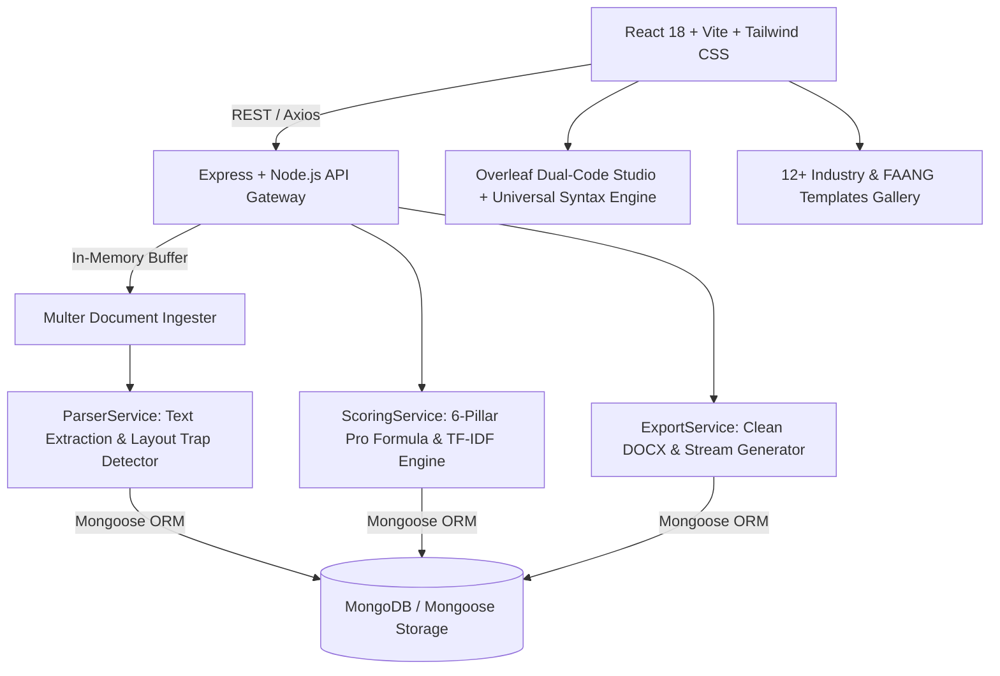

# 🚀 ATS-AI (`ResumeIQ`) — Enterprise 6-Pillar Deterministic MERN ATS Optimization Platform

[](https://opensource.org/licenses/MIT)
[](https://nodejs.org/)
[](https://vitejs.dev/)
[](https://expressjs.com/)

**ATS-AI (`ResumeIQ`)** is a full-stack MERN platform designed to demystify Applicant Tracking Systems (Workday, Taleo, Greenhouse, iCIMS). Unlike generic AI wrappers that hallucinate skills or output unparseable layouts, **ATS-AI** uses a **Deterministic 6-Pillar Scoring Engine** combined with N-gram keyword extraction, structural parseability audits, and anti-fabrication bullet rewrite guardrails.

---

## ✨ Key Features

### 🔍 1. Deterministic 6-Pillar ATS Audit Engine
Our proprietary algorithm calculates a composite compatibility score (`0-100`) weighted across six foundational resume dimensions:
1. **Exact N-Gram Keyword Match Rate (30% Weight)**: Evaluates required hard skills, preferred credentials, and software tools against target job descriptions with double penalties for missing mandatory competencies.
2. **Formatting & Parseability Audit (15% Weight)**: Automatically detects structural traps—such as multi-column sidebars, table grids, non-standard section headers, and contact information leaks—that cause left-to-right ATS parser failures.
3. **Quantification & Impact Breakdown (15% Weight)**: Scans every work experience bullet for concrete metrics (`%`, `$`, multiplier numbers) to reward quantifiable achievements over vague responsibilities.
4. **Action-Verb Power Score & Vocabulary Repetition Audit (15% Weight)**: Rewards strong leadership and technical action verbs (`Architected`, `Spearheaded`, `Engineered`) while flagging weak passive phrases (`Responsible for`, `Assisted with`) and redundant word repetitions.
5. **Seniority & Competency Alignment (15% Weight)**: Matches candidate vocabulary against detected job seniority levels (`Junior/Entry`, `Mid-Level`, `Senior/Staff`, or `Leadership/Manager`).
6. **Readability & Skim-ability Audit (10% Weight)**: Validates bullet lengths against the optimal 12–28 word skim density window for recruiter review.

### ⚡ 2. One-Click Auto-Skill & Action-Verb Injection
- **Instant Keyword Optimization**: Click **⚡ Auto-Inject Missing Skills** on the score report to safely merge exact missing hard skills and tool credentials into your profile.
- **Automated Vocabulary & Action-Verb Relocation**: Automatically rewrites repetitive bullet beginnings and weak verbs (`Developed and developed`, `Managed and managed`, `Responsible for`) directly into high-impact action verbs (`Engineered and architected`, `Spearheaded and directed`) inside your resume code.
- **Snapshot Versioning**: Automatically generates version snapshots (`v1.0 + Pro Keywords`) and dynamically recalculates your composite ATS score in real time.

### 👨‍💻 3. Dual Overleaf LaTeX Code Studio & Universal Syntax Engine
- **Overleaf-Style Split-Pane IDE (`/editor/:id`)**: Edit your resume using either the **`👨‍💻 Overleaf LaTeX Code Mode`** (`main.tex` source code on the left with Letterpaper 8.5" x 11" real-time visual preview on the right) OR the **`🎛️ Visual Form Studio`** with zero data loss when toggling back and forth.
- **Universal Document Syntax Engine (`UniversalPreviewRenderer`)**: Our advanced document parser evaluates and renders **HTML tags (`<br>`, `<hr>`, `<h1>`, `<b>`, `<ul>`, `<li>`)**, **LaTeX commands (`\section{}`, `\textbf{}`, `\item`, `\newline`, `\\`, `\vspace{}`)**, and **Markdown syntax (`#`, `**`, `-`)** directly into real, styled Letterpaper DOM elements without displaying raw syntax tags.
- **Instant Debounced Recompilation (`Auto-Recompile`)**: As you type syntax or modify bullet text, the visual preview debounces and re-renders in real-time, alongside a **`🔄 Recompile Preview`** button for manual synchronization and ATS score updates.

### 📑 4. 12+ Industry-Specific & Famous Company ATS Templates Gallery (`/templates`)
- **Curated Career Track Templates**: Explore at least 12 specialized templates tailored for distinct job roles (**Frontend/MERN Engineer**, **Backend/Distributed Systems Architect**, **Data Science & AI/ML Engineer**, **Cloud & DevOps Site Reliability**, **Product Manager**, **Cybersecurity Analyst**, and more).
- **Famous Big-Tech Layouts**: Pick from battle-tested layouts used by top engineers, including **Google/FAANG Standard Single-Column**, **Amazon Leadership Principles Format**, **Stripe Minimalist Single-Column**, and **Y-Combinator Startup Engineering Profile**.
- **Role-Specific Advice & One-Click Creation**: View targeted recommendations on which key competencies and metrics to feature for each role, and click **Create Profile From Template** to immediately launch an editable Overleaf workspace.

### ✍️ 5. AI Bullet Coach & Clean Document Exporter
- **Granular Bullet-by-Bullet Review**: Inspect every experience bullet with real-time highlights for weak verbs and missing numbers.
- **Clean Single-Column Exporter**: Export fully optimized profiles directly to clean, single-column **`.docx`** or **`.txt`** formats guaranteed to parse seamlessly through enterprise ATS systems without table or column errors.

### 📊 6. Integrated Job Application Kanban Tracker
- Keep track of targeted roles (`Applied`, `Interviewing`, `Offer`, `Rejected`) alongside your tailored resume version snapshots.

---

## 🏗️ System Architecture & Tech Stack



### **Frontend**
- **Framework**: React 18 with Vite for lightning-fast HMR and building.
- **Styling & UI**: Tailwind CSS with custom glassmorphic cards, gradients, responsive mobile wrapping (`ScoreReport`), and modern dark-theme aesthetics.
- **Document Engine**: Universal Document Syntax Engine (`UniversalPreviewRenderer`) supporting inline conversion of HTML, LaTeX (`\section`, `\textbf`, `\item`), and Markdown to live DOM nodes.
- **Routing**: React Router v6 (`LandingPage`, `Dashboard`, `NewScan`, `ScoreReport`, `ResumeEditor`, `Templates`, `Applications`, `Settings`).

### **Backend**
- **Runtime & Server**: Node.js (v18+) with Express.js.
- **Database**: MongoDB with Mongoose ORM (`Resume`, `ResumeVersion`, `JobDescription`, `ScoreReport`, `Application` models).
- **Document Processing**: `multer` memory storage for secure in-memory ingestion (`.pdf`, `.docx`, `.txt` support).
- **Core Services**: Modular business logic separated cleanly into `ParserService`, `ScoringService`, `ExportService`, and `AiService`.

---

## 🚀 Getting Started

### Prerequisites
- **Node.js**: v18.0.0 or higher
- **npm**: v9.0.0 or higher
- **MongoDB**: Local MongoDB instance (`mongodb://127.0.0.1:27017/ats-ai`) or MongoDB Atlas URI

### 1. Clone the Repository
```bash
git clone https://github.com/aaryamanmodi353-rgb/Ats-ai.git
cd Ats-ai
```

### 2. Environment Setup
Create a `.env` file inside the `backend/` directory:
```env
PORT=5000
MONGODB_URI=mongodb://127.0.0.1:27017/ats-ai
NODE_ENV=development
```

### 3. Install Dependencies & Start Development Servers

#### Option A: Concurrent Run from Root (if root scripts configured) or Dual Terminal

**Terminal 1 — Backend API Server (`http://localhost:5000`)**:
```bash
cd backend
npm install
npm run dev
```

**Terminal 2 — Frontend Vite Application (`http://localhost:5173`)**:
```bash
cd frontend
npm install
npm run dev
```

Once both servers are running, open your browser to **[http://localhost:5173](http://localhost:5173)** to launch the platform.

---

## 📖 How to Use the Platform

1. **Upload Resume or Start From 12+ Industry Templates**:
   - Navigate to **New Scan** (`/resume/new`) to drag-and-drop a `.pdf` / `.docx` / `.txt` file or paste your raw resume text.
   - Or navigate to **Templates (`/templates`)** to browse 12+ specialized career track templates (`Frontend/MERN`, `Distributed Systems`, `AI/ML`, `Cloud/DevOps`, `Cybersecurity`) or famous FAANG layouts (`Google Standard`, `Amazon Leadership`, `Stripe Minimal`), complete with role-specific keyword recommendations. Click **Create Profile From Template** to jump right in!
2. **Provide Target Job Description**:
   - Paste the full job posting requirements or provide a job URL to run N-gram exact keyword extraction.
3. **Run Instant 6-Pillar ATS Audit & Vocabulary Check**:
   - Click **Run Instant ATS Audit** to trigger deterministic N-gram parsing, layout trap checks, and word repetition/weak verb diagnostics.
4. **Inspect Score & Auto-Inject Missing Keywords**:
   - Review your `0-100` composite score and the 6-pillar breakdowns (`Keywords`, `Format`, `Metrics`, `Action Verbs`, `Seniority`, `Readability`).
   - Click **⚡ Auto-Inject Missing Skills** or **Vocabulary Check** to automatically merge exact missing competencies and replace weak/repetitive phrases (`Developed and developed`) with powerful action verbs (`Engineered and architected`).
5. **Edit in Dual Overleaf Code Studio & Export Clean Documents**:
   - Open your snapshot inside the **Live Overleaf Studio (`/editor/:id`)**.
   - Toggle seamlessly between **`👨‍💻 Overleaf LaTeX Code Mode`** (with real-time Letterpaper 8.5" x 11" visual preview driven by our Universal Syntax Engine) and **`🎛️ Visual Form Mode`**.
   - Type HTML (`<br>`), LaTeX (`\section{}`), or Markdown (`**bold**`), watch the visual DOM output render instantly, and click **Export DOCX** or **Export TXT** to download your 100% ATS-compliant resume!

---

## 🔒 Security & Privacy

- **Local Processing**: By default, resumes and job descriptions are parsed in-memory and stored in your isolated database.
- **Zero PII Leakage**: Candidates can clear cached snapshots and personal identifiable information (PII) at any time from the **Settings** (`/settings`) panel (`Purge PII & Cache`).

---

## 🤝 Contributing

Contributions, issues, and feature requests are welcome! Feel free to check the [issues page](https://github.com/aaryamanmodi353-rgb/Ats-ai/issues).

1. Fork the Project
2. Create your Feature Branch (`git checkout -b feature/AmazingFeature`)
3. Commit your Changes (`git commit -m 'Add some AmazingFeature'`)
4. Push to the Branch (`git push origin feature/AmazingFeature`)
5. Open a Pull Request

---

## 📝 License

This project is licensed under the **MIT License**. See the [LICENSE](https://opensource.org/licenses/MIT) file for details.
